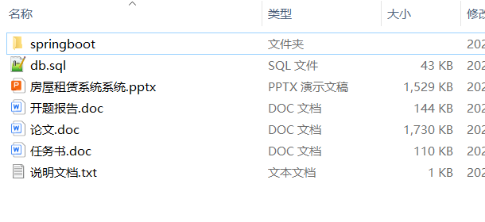

# springboot_violation_waste_shop

📦 SpringBoot多功能项目仓库 🎯

本仓库汇集了三个基于 **Spring Boot** 开发的高实用性项目，涵盖 **车辆违章管理、垃圾分类管理、商城系统** 等多个领域，适用于学习、开发实践和功能拓展！🚀

🚗 **车辆违章信息管理系统** —— 提供**违章信息录入、查询、罚款缴纳、违章统计分析**等功能，助力**交通管理**数字化 📋📊

♻️ **城市垃圾分类管理系统** —— 支持**垃圾分类投放、垃圾回收跟踪、分类宣传、分类积分奖励**等功能，提升**垃圾分类管理**智能化 🏙️✅

🛍️ **商城系统** —— 实现**商品管理、订单管理、购物车、在线支付、物流跟踪、用户评价**等功能，打造便捷高效的**电商购物平台** 💰🚀 

**项目部署说明**✨：

推荐使用：**谷歌浏览器**

**后台地址**😎

http://localhost:8080/springboot/admin/dist/index.html

**前台地址**😎

http://localhost:8080/springboot547vl/front/index.html

在**src\main\resources\application.yml中**编辑数据库配置🎉										
url:jdbc:mysql://127.0.0.1:3306/springbootuseUnicode=true&characterEncoding=utf8&useJDBCCompliantTimezoneShift=true&useLegacyDatetimeCode=false&serverTimezone=UTC
username: root
password: 123456

**文档预览**👀

**其他项目合集**✨

